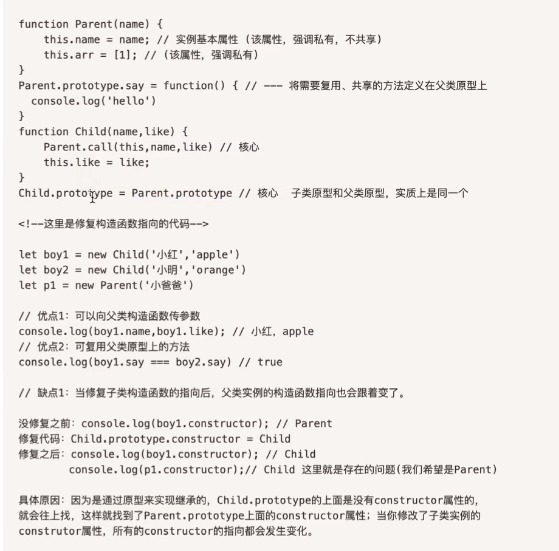

# 闭包

###### 1.JavaScript 中的作用域和作用域链

* 作用域就是一个独立的地盘，让变量不会外泄、暴露出去，不同作用域下同名变量不会有冲突。
  作用域在定义时就确定，并且不会改变。
  如果在当前作用域中没有查到值，就会向上级作用域去查，直到查到全局作用域，这么一个查找过程形成的链条就叫做作用域链。

###### 2. JavaScript 中的垃圾回收

* Javascript 执行环境会负责管理代码执行过程中使用的内存，其中就涉及到一个垃圾回收机制
  垃圾收集器会定期（周期性）找出那些不再继续使用的变量，只要该变量不再使用了，就会被垃圾收集器回收，然后释放其内存。如果该变量还在使用，那么就不会被回收。

闭包不是一个具体的技术，而是一种现象，是指在定义函数时，周围环境中的信息可以在函数中使用。换句话说，执行函数时，只要在函数中使用了外部的数据，就创建了闭包。

而作用域链，正是实现闭包的手段。

一个立即执行的匿名函数

```
(function (x) {
    return x * x;
})(3);
```

# 理解原型链

每个函数都有 ` prototype` 属性(这个要好好理解)

* 这个属性的值是个对象，即  `原型对象`
* 存放方法和属性
* 实现继承

**每个对象都有   `__proto__ `属性**

* 指向  `原型对象`      ,即 `arr.__proto__ === Array.prototype`


# 继承


 





# JavaScript引擎


# 回调

```
回调是闭包的一种形式。
JavaScript 是事件驱动的语言。这意味着，JavaScript 不会因为要等待一个响应而停止当前运行，而是在监听其他事件时继续执行，回调正是确保一段代码执行完毕之后再执行另一段代码的方式。
 异步编程：JS代码的执行顺序

回调就是为了保证顺序执行，是业务上的一种逻辑要求在js中代码实现
```
```
    <div id="myDiv">学习事件监听</div>
    <script>
        var myDiv = document.getElementById('myDiv');
        myDiv.addEventListener('click', function () {
            console.log(event.clientX + ',' + event.clientY);
        });
    </script>
```
这边监听函数一定要注意要在div渲染完成之后加载，不然会报错，这个点后续也要记住，一开始js函数写 `<head></head>`标签里，浏览器报错找不到属性，原因html解析，是从上到下，先调用了函数，结果dom树下面部分还没生产就执行函数，导致函数找不到对象


# DOM树


